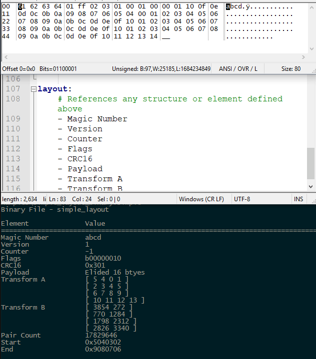

# Bender
A YAML driven binary file viewer

This program reads in a binary file specification written in YAML and emits neat, formatted data to your console. 

## Why Use Bender 

Parsing binary files containing arbitrary and dynamic can be tedious. A typical use case would be serialized binary 
data consumed by space-constrained device. You might not need a parser, perhaps you have safely figured out a struct 
packing scheme to read and write the data. However, when you want to peek at the data from outside of your application,
you must write a parser or use some type of hex dump application. 

Bender allows you to define you binary layout in plain-text to control how the contents are rendered for you. This 
tool really shines when you have non-trivial data structures with dynamic layouts.

1) Define your YAML spec
2) Feed YAML spec and a binary to Bender
3) Save a few brain cycles analyzing the binary



## YAML Definition
| Name | Default Value | Description |
|:-----|:--------------|:------------|
| format | bender.v1 | Version of this specification |
| name | _empty_ | Human friendly name of your spec |
| extensions | _empty_ | List of extensions associated with the file you are describing |
| base_element | Default Values for each type in Element | The default element for your spec |
| structures | _empty_ | Complex data types, e.g. structs |
| elements | _empty_ | Named definition of data in your binary |
| layout | _empty_ | Ordered list of elements as they are expected to be found in a binary. |

### Element Object
The fundamental component of Bender is the element. This is the name we use to describe one or more bytes in a binary 
file. It has a collection of fields that control how the bytes are read, stored, and displayed. Elements can be 
immediate values (e.g. the current read position) or deferred objects. In the latter case, a deferred object is a marker
of 8 bytes describing the offset and size of the real data, each of which are 4 bytes in width.

You may take advantage of YAML merge keys to generate base objects from which you can build your elements.

| Field | Description | Legal Values |
|:------|:------------|:-------------|
| name | Name to display for this element | strings |
| elide | Hide this element from display | YAML bool |
| units | How many bytes are in this element | A positive integer |
| signed | Represent bytes as a signed value | YAML bool |
| format | How the bytes should be interpreted | binary, octal, decimal, hex, ascii, unicode, hexstr, float |
| little_endian | What order the bytes are stored in the file | YAML bool |
| is_deferred | True if this object is a deferral | Optionally specify that this element is a pointer to more data |
| is_array_count| True if this value is a count of the next object | Optionally hint that the next object is repeated N times |
| matrix | Optional matrix definition | Defines the shape of the data as a matrix type |

### Deferred Object
Sometimes your binary has dynamic data. We can still parse it by using a deferred definition. Using this approach, you 
are defining a contract that gives an offset (relative to the start of the file) and a size in bytes of future data. 
Once all the elements have been read, the deferred data types are processed according to your spec.

This pattern is based on the technique of inserting a marker in your binary that is effectively a custom pointer. Both 
the size and offset must be 4-byte values. There are no plans to support alternative integer sizes for these values.

```
typedef def_location_t {
	uint32_t offset;
	uint32_t size;
};
```

### Matrix Object
A matrix element is a definition for representing your data as a matrix. When a matrix is detected by the Bender parser, 
the format of the parent element controls the representation of the bytes. For deferred objects, the total size is 
captured from the 4-byte size definition which is used to calculate the total row count. For immediate objects,
the element's units field is used to determine the total size.

| Field | Description | Legal Values |
|:------|:------------|:-------------|
| columns | How many variables per row | A positive integer |
| units | How many bytes per variable | A positive integer |


### Structure Object
Sometimes your data is more than just a number or a matrix. Use structures to define sequences of bytes that create more 
complicated data types. Each element may also contain structures, matrices, and can be a mix of deferred and immediate 
objects.

There are no checks in place to detect circular references so be careful. Also, the only limit on structure depth is 
your stack size. 

| Field | Description | Legal Values |
|:------|:------------|:-------------|
| name  | Name referenced by and element | strings |
| elements | A list of elements contained in this structure | Any valid Element listed under structure_elements |

## Arrays
Any numeric element can be marked as an array to indicate that the next element should be repeated a number of times. 
This supports a structure similar to the following:

```
typedef def_array_t {
	uint32_t aCount;
	struct some_struct_t a[SOME_CONSTANT_A];
	uint32_t bCount;
	int b[SOME_CONSTANT_B]
};
```

This allows you to support immediate data with arbitrary length. The count and the element being repeated are separate 
objects so you can name and format them separately. Any type of element can be repeated.

## Format 
An element may be formatted as any of the following:

- binary Uses 0b prefix, e.g. 0b00000010 == 2
- octal Uses O prefix, e.g. O11 == 9
- decimal No prefix
- hex Uses 0x prefix
- ascii Interprets string as 7-bits per character. Length is == Units of elements. 
- unicode Interprets string as unicode characters. Length in bytes will not equal count of bytes.
- bigint Interprets arbitrary count of bytes as a hex formatted string without a prefix.
- float Units must be 4 bytes for single precision or 8 bytes for double precision.

For string types, the units field of element is the count of letters in the string. For ASCII, that happens to 
be equal to the count of bytes. For Unicode, since each character is composed of multiple bytes,
the length in bytes will not equal the character count.

